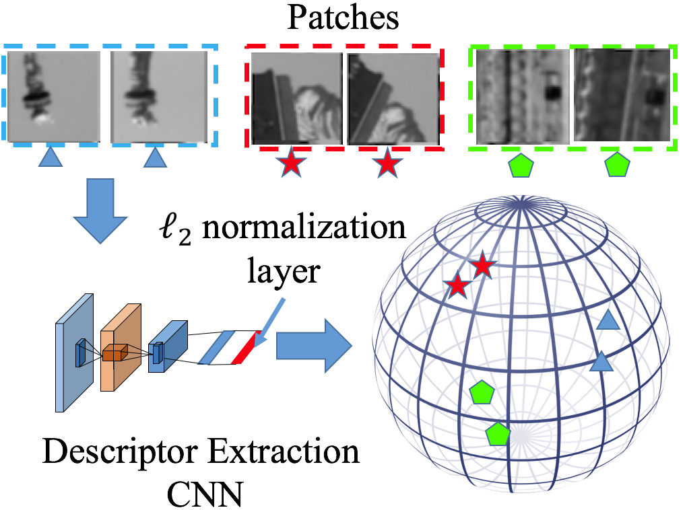
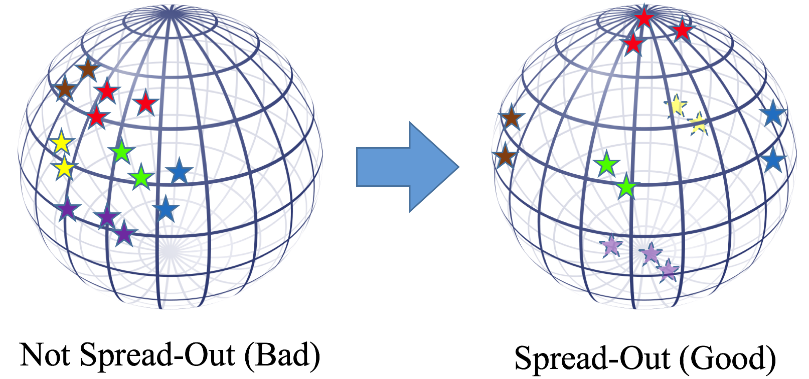
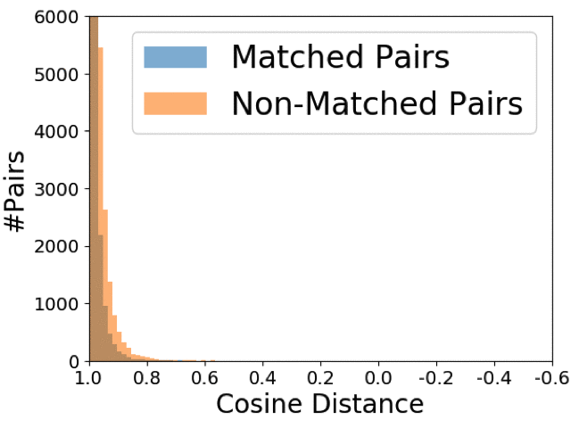
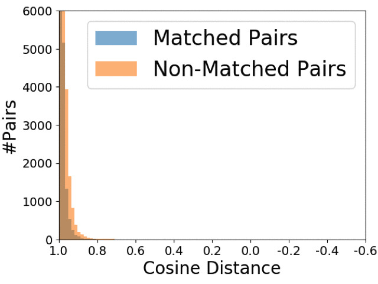

# Spread-out Descriptor with HardNet

[Learning Spread-out Local Feature Descriptor](https://arxiv.org/abs/1708.06320) with HardNet model [(Working hard to know your neighbor's margins: Local descriptor learning loss)](https://arxiv.org/abs/1705.10872) in PyTorch.

## Introduction

Descriptor extraction is mapping an image patch to a point in the descriptor space.



To spread out all the points in the descriptor space helps us to fully utilize the descriptor space.



Since uniform distribution has nice 'spread-out' property, we learn a descriptor that has similar as uniform distribution on sphere.

We randomly sample non-matching patches from dataset and let the mean and second order moment of the cosine distance of the descriptors to be close to those of uniformly randomly sampled points on unit sphere (0 mean and 1/d second order moment).
## Requirements

Please use Python 2.7, install OpenCV and additional libraries from requirements.txt

## Run the code

```bash
cd code/
```
Compare Triplet and triplet + GOR

```python
python check_gor_Triplet.py
```

Result will be stored in ../ubc\_triplet\_log/

Compare HardNet and HardNet + GOR

```python
python check_gor_HardNet.py
```

Result will be stored in ../ubc_log/


## Result and Discussion
###Training set: NotreDame, Test set: Yosemite, Baseline: Triplet loss
 
**ROC Curve**

 

**Distribution of the cosine distance of matching pairs and non-matching pairs in test set 
(iteration is aligned to the roc curve)**

**Triplet:**   

  

**Triplet + GOR:**



We can see that with the proposed regularization, the distribution of the non-matching pairs has small variance which leads to better result. 


## Citation

Please cite us if you use this code:

```
@inproceedings{zhang2017learningb,
title={Learning Spread-out Local Feature Descriptors},
author={Zhang, Xu and Yu, Felix X. and Kumar, Sanjiv and Chang, Shih-Fu},
booktitle={ICCV},
year={2017}
}
```

## Acknowledgement
We thank

TFeat [1] and HardNet [2] 

for offering the baseline implementation. 

and

UBC dataset [3]

for providing the image data.

[1] V. Balntas, E. Riba, D. Ponsa, and K. Mikolajczyk. Learning local feature descriptors with triplets and shallow convolutional neural networks. BMVC, 2016

[2] A. Mishchuk, D. Mishkin, F. Radenovic, and J. Matas. Working hard to know your neighbor's margins: Local descriptor learning loss. NIPS 2017

[3] M. Brown, G. Hua, and S. Winder. Discriminative Learning of Local Image Descriptors. TPAMI, 2011


